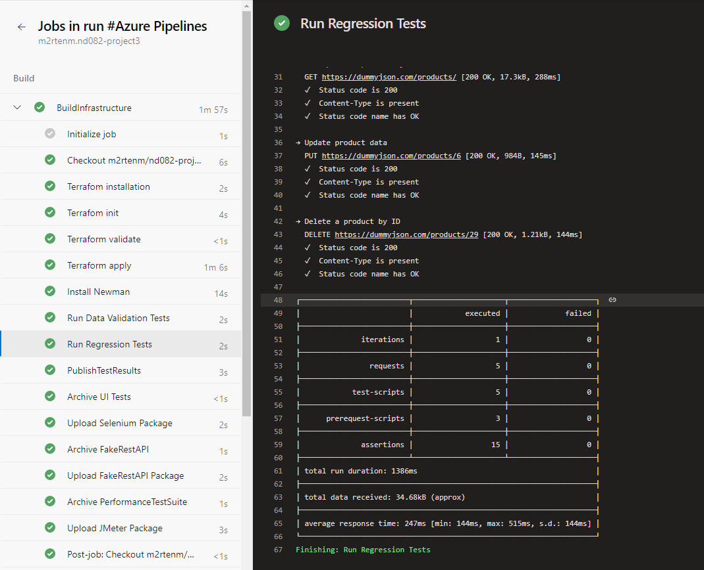
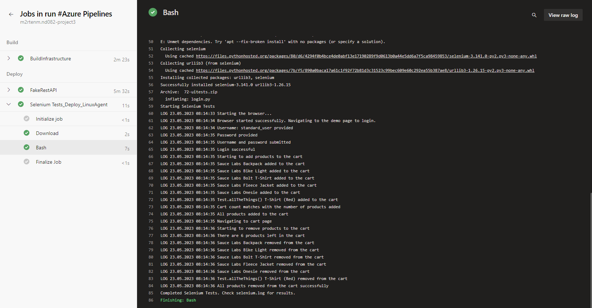

# Project Intro
This repository contains the starter code for the **Ensuring Quality Releases** project of the cd1807 Ensuring Quality Releases (Quality Assurance) course taught by Nathan Anderson. It is also the final project for the Udacity Nanodegree of "Cloud DevOps using Microsoft Azure". This project is about creating a CI/CD pipeline containing quality assurance tests.

# Necessary tools for getting started
To complete this project, you need the following resources:
- [Azure account](https://portal.azure.com)
- [Azure DevOps account](https://dev.azure.com)
- [JMeter](https://jmeter.apache.org)
- [Postman](https://www.postman.com)
- [Selenium](https://www.selenium.dev)
- [Terraform](https://www.terraform.io/)
- [Packer](https://www.packer.io/)

# Steps covered in the project

## 1. Terraform output in CI/CD pipeline

## 2. Output of CI/CD pipeline successful build run

## 3. Performance testing with JMeter

### Endurance test report

### Stress test report

### JMeter output in CI/CD pipeline

## 4. Integration testing with Postman
For integration testing with Postman, the original fake REST API couldn't be used because it was not working as intended. Therefore, an another API https://dummyjson.com was used.

### Results of data validation

### Results of regression testing

### Summary of the whole test run

## 5. UI testing with Selenium

### Selenium tests output in CI/CD pipeline

### Azure monitor with Selenium logs

## 6. Azure monitoring

### Azure monitoring chart

### Triggered email alert
